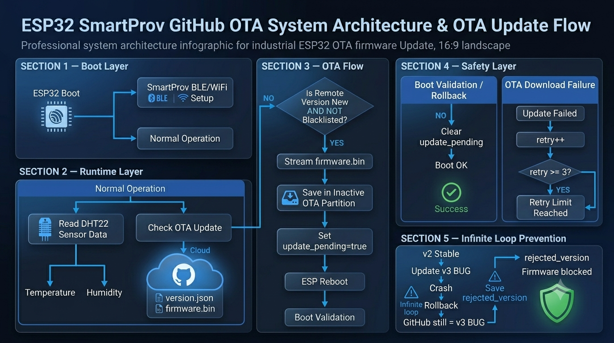

# ESP32 SmartProv GitHub OTA — Industrial Firmware Update System

<p align="center">
  
  
  
  
  
  
  
  
  
</p>

<p align="center">
  An industrial-grade ESP32 weather monitoring node featuring SmartProv provisioning, robust GitHub-hosted Over-The-Air (OTA) updates, automated crash rollback and infinite boot-loop prevention mechanisms.
</p>

---

## Table of Contents

- [Overview](#-overview)
- [System Architecture](#-system-architecture)
- [Features](#-features)
- [Project Structure](#-project-structure)
- [Technology Stack](#-technology-stack)
- [How Industrial OTA Works](#-how-industrial-ota-works)
- [Infinite Loop Prevention](#-infinite-loop-prevention)
- [Installation & Setup](#-installation--setup)
- [Managing Firmware Versions](#-managing-firmware-versions)

---

## Overview

**ESP32 SmartWeatherNode** is an advanced IoT boilerplate project that solves one of the biggest challenges in remote device management: **Safe Firmware Updates**. It continuously monitors temperature and humidity (DHT sensor), but its core power lies in how it updates itself.

Instead of relying on an expensive custom cloud backend, this system uses a free **GitHub Repository** to host its firmware. The ESP32 parses a `version.json` file hosted directly on GitHub, streams the `.bin` to its OTA partition, and applies strict **failsafe mechanisms**. If the new code crashes or breaks WiFi connectivity, the ESP32 automatically rolls back to the previous stable version and "blacklists" the faulty firmware.

---

## System Architecture



**Data & Update Flow:**

1. ESP32 boots up and initializes `SmartProv` for WiFi configuration.
2. The core system runs the DHT sensor reading loop.
3. Every 10 seconds, `OTAManager` fetches `https://raw.githubusercontent.com/.../firmware/latest/version.json`.
4. If `remote_version != FW_VERSION` AND the remote version is not blacklisted, it begins streaming the `.bin` file into the ESP32's inactive OTA partition.
5. Upon successful download, `update_pending` is set in Non-Volatile Storage (NVS), and the board reboots.
6. **Safety Check:** If the board successfully connects to WiFi, it clears the `update_pending` flag (Boot OK). If it crashes 3 times, `Update.rollBack()` is triggered.

---

## Features

### Industrial OTA Manager

| Feature                   | Description                                                                   |
| ------------------------- | ----------------------------------------------------------------------------- |
| **GitHub Hosting**        | Zero-cost server. Streams `.bin` raw files smoothly over HTTPS.               |
| **Download Failsafe**     | Maximum 3 retry limits for network drops during `.bin` download.              |
| **Boot Validation**       | Flashes flag in NVS. Booting fully verifies the firmware stability.           |
| **Auto Rollback**         | Reverts to the previous OTA partition if the new code crashes 3 times.        |
| **Firmware Blacklisting** | Remembers `rejected_version` to prevent infinite update-crash-rollback loops. |

### Core Node Features

| Feature                     | Description                                                                  |
| --------------------------- | ---------------------------------------------------------------------------- |
| **SmartProv Integration**   | Uses native ESP provision infrastructure for seamless BLE/WiFi setup.        |
| **DHT Environment Monitor** | Accurate Temperature and Humidity tracking built into the non-blocking loop. |
| **Dual Codebase Sync**      | Maintains an Arduino IDE (`.ino`) and VSCode (`.cpp`) synced structure.      |

---

## Project Structure

```text
esp32-smartprov-github-ota/
│
├── Images/                         # Project Documentation Images
│   └── System_Arc.png              # Architecture Diagram
│
├── firmware/                       # Hosted Firmware Files for OTA
│   ├── latest/
│   │   └── version.json            # ESP32 checks this file to find updates
│   └── releases/                   # All firmware binary releases
│       ├── v1.0.0/
│       ├── v2.1.0/
│       ├── v2.2.0/                 # Stable Rollback Supported Framework
│       └── v3.0.0-BUG/             # Used for testing Failsafe Rollbacks
│
├── smart_weather_node_v1/          # Primary Arduino IDE Structure
│   ├── app_config.h
│   ├── dht_manager.cpp/h
│   ├── ota_manager.cpp/h           # OTA Logic and Rollback rules
│   ├── provision_manager.cpp/h     # SmartProv functionality
│   ├── version_manager.cpp/h       # Firmware version & names
│   └── smart_weather_node_v1.ino   # Main application loop
│
├── smart_weather_node_v1_temp_only/# V1 Version (Temp Only) - Manual Flash Test
│   └── smart_weather_node_v1_temp_only.ino
│
├── src/                            # PlatformIO / VSCode Structure
│   ├── main.cpp
│   ├── config/                     # Pinouts and App settings
│   └── managers/                   # Synced modular classes
│       ├── logger/
│       ├── ota/
│       ├── provision/
│       ├── sensor/
│       └── version/
│
├── CHANGELOG.md                    # Detailed version history
└── README.md                       # Project documentation
```

---

## Technology Stack

| Tool / Library           | Purpose                                                                  |
| ------------------------ | ------------------------------------------------------------------------ |
| **C++ / Arduino Core**   | Primary firmware environment for ESP32.                                  |
| **Update.h**             | ESP32 native OTA library for writing stream streams to partitions.       |
| **HTTPClient.h**         | For secure HTTPS fetching of `version.json` and `.bin` payloads.         |
| **ArduinoJson.h**        | Parsing the GitHub-hosted Version descriptor.                            |
| **Preferences.h**        | Non-Volatile Storage (NVS) for tracking boot crashes & blacklisted bugs. |
| **Git / GitHub Actions** | Code versioning and fast `.bin` deployments.                             |

---

## How Industrial OTA Works

Traditional OTA updates are dangerous: if a bug prevents the ESP32 from connecting to WiFi after the update, the device is "bricked" and requires physical USB flashing.

**Our Failsafe Solution:**

1. **Prepare:** Before downloading, we record current states in NVS.
2. **Flash:** Write the new firmware straight to the alternate OTA partition (`Update.writeStream`).
3. **Set Trap:** We save `otaPrefs.putBool("update_pending", true)` and Reboot.
4. **Validation:**
   - _Success:_ If the code reaches the `WiFi.status() == WL_CONNECTED` state, we clear the `update_pending` flag.
   - _Failure:_ If the code crashes (e.g., watchdog timer, fatal error), `boot_fails` increments.
5. **Rollback:**
   ```cpp
   if (boot_fails >= 3) {
       otaPrefs.putString("rejected_version", FW_VERSION);
       Update.rollBack();
       ESP.restart();
   }
   ```

---

## Infinite Loop Prevention

**The "Zombie Update" Problem:**
When a board rolls back, it reverts to the old version (e.g., v2.2). But GitHub still hosts the broken version (e.g., v3.0-BUG). The board will see v3.0, update, crash, rollback, and repeat forever.

**The Solution:**
When rolling back, the board saves the broken version's name (`rejected_version`). During the next OTA check:

```cpp
String rejected = otaPrefs.getString("rejected_version", "");
if (remote == rejected) {
    Serial.println("[OTA] Update Blocked: Version was previously rejected!");
    return; // Stops the infinite loop
}
```

---

## Installation & Setup

### For Developers (USB Flashing)

1. Open the `/smart_weather_node_v1/` directory in Arduino IDE.
2. Select **Tools -> Partition Scheme -> Minimal SPIFFS (Large APP with OTA)**. _(Crucial for OTA to work)_
3. Connect ESP32 via USB and click **Upload**.

### For Production (Exporting Firmware)

1. Go to `version_manager.h` and update `#define FW_VERSION "2.3.0"`.
2. In Arduino IDE, click **Sketch -> Export Compiled Binary**.
3. Move the `.bin` file to `firmware/releases/v2.3.0/firmware.bin`.
4. Update `firmware/latest/version.json` with the new version and URL.
5. `git commit` and `git push`. Devices in the field will update automatically!

---

## Managing Firmware Versions

Because the ESP32 blindly follows `version.json`, you have complete control over downgrades and upgrades.

**To Downgrade a Fleet:**
Change `version.json` to point to an older release URL. The ESP32 will see that the remote version differs from its current version, format the active partition, and safely flash the older software.

---

## Author

Shahriar Alom Masud  
B.Sc. Engg. in IoT & Robotics Engineering  
University of Frontier Technology, Bangladesh  
Email: shahriar0002@std.uftb.ac.bd  
LinkedIn: https://www.linkedin.com/in/shahriar-alom-masud

---

## License

This project is licensed under the MIT License. See the [LICENSE](LICENSE) file for details.

---

## Acknowledgments

- Espressif Systems — ESP32 Platform
- Arduino Framework — Embedded Development
- SmartProv — WiFi Provisioning
- GitHub Releases — OTA Hosting
- ArduinoJson — Metadata Parsing
- DHT Sensor Library — Environment Monitoring

---

If you found this project useful, consider giving it a star on GitHub!
